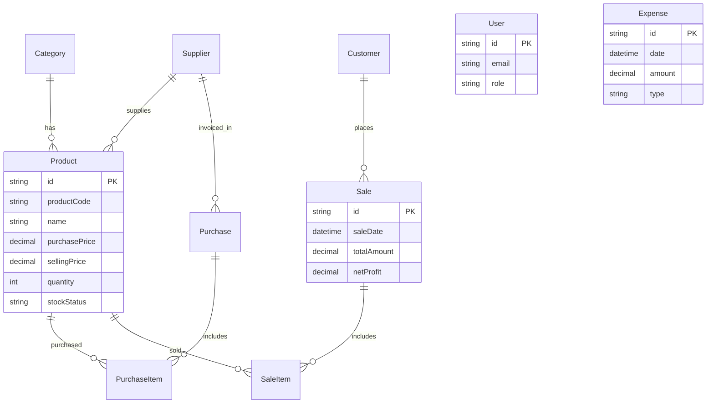

# ER Diagram

```mermaid
erDiagram
  Category ||--o{ Product : has
  Supplier ||--o{ Product : supplies
  Supplier ||--o{ Purchase : invoiced_in
  Purchase ||--o{ PurchaseItem : includes
  Product ||--o{ PurchaseItem : purchased
  Customer ||--o{ Sale : places
  Sale ||--o{ SaleItem : includes
  Product ||--o{ SaleItem : sold

  User {
    string id PK
    string email
    string role
  }

  Product {
    string id PK
    string productCode
    string name
    decimal purchasePrice
    decimal sellingPrice
    int quantity
    string stockStatus
  }

  Sale {
    string id PK
    datetime saleDate
    decimal totalAmount
    decimal netProfit
  }

  Expense {
    string id PK
    datetime date
    decimal amount
    string type
  }
```
