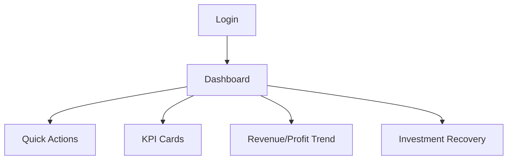
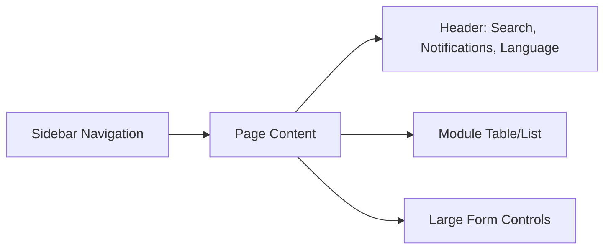

# UI Wireframes

```mermaid
flowchart TB
  A[Login] --> B[Dashboard]
  B --> C[Quick Actions]
  B --> D[KPI Cards]
  B --> E[Revenue/Profit Trend]
  B --> F[Investment Recovery]
```

```mermaid
flowchart LR
  S[Sidebar Navigation] --> P[Page Content]
  P --> H[Header: Search, Notifications, Language]
  P --> T[Module Table/List]
  P --> F[Large Form Controls]
```
