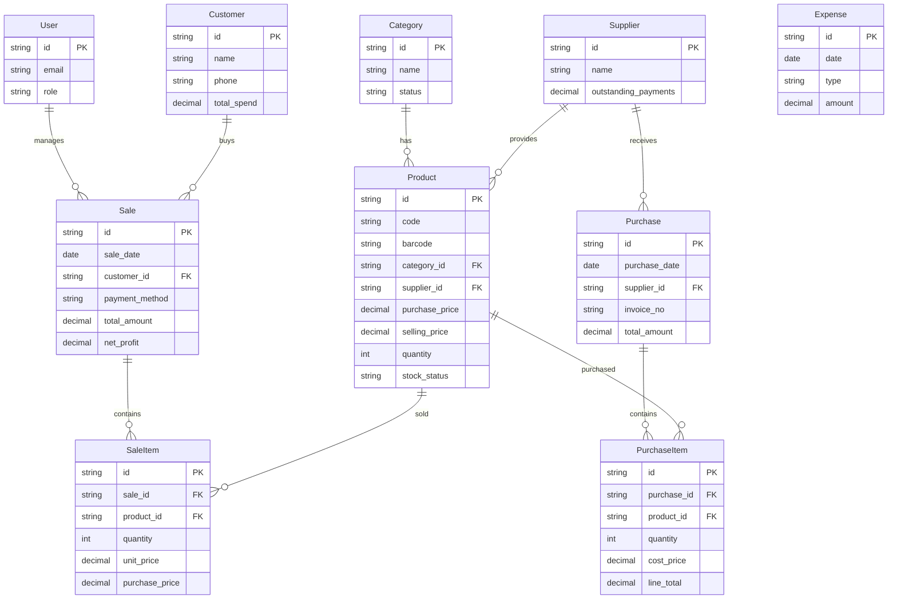

# ER Diagram

```mermaid
erDiagram
  User ||--o{ Sale : manages
  Category ||--o{ Product : has
  Supplier ||--o{ Product : provides
  Supplier ||--o{ Purchase : receives
  Purchase ||--o{ PurchaseItem : contains
  Product ||--o{ PurchaseItem : purchased
  Customer ||--o{ Sale : buys
  Sale ||--o{ SaleItem : contains
  Product ||--o{ SaleItem : sold

  User {
    string id PK
    string email
    string role
  }

  Category {
    string id PK
    string name
    string status
  }

  Supplier {
    string id PK
    string name
    decimal outstanding_payments
  }

  Customer {
    string id PK
    string name
    string phone
    decimal total_spend
  }

  Product {
    string id PK
    string code
    string barcode
    string category_id FK
    string supplier_id FK
    decimal purchase_price
    decimal selling_price
    int quantity
    string stock_status
  }

  Purchase {
    string id PK
    date purchase_date
    string supplier_id FK
    string invoice_no
    decimal total_amount
  }

  PurchaseItem {
    string id PK
    string purchase_id FK
    string product_id FK
    int quantity
    decimal cost_price
    decimal line_total
  }

  Sale {
    string id PK
    date sale_date
    string customer_id FK
    string payment_method
    decimal total_amount
    decimal net_profit
  }

  SaleItem {
    string id PK
    string sale_id FK
    string product_id FK
    int quantity
    decimal unit_price
    decimal purchase_price
  }

  Expense {
    string id PK
    date date
    string type
    decimal amount
  }
```
