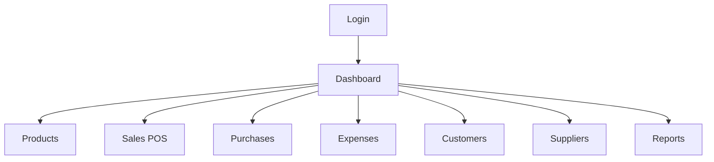
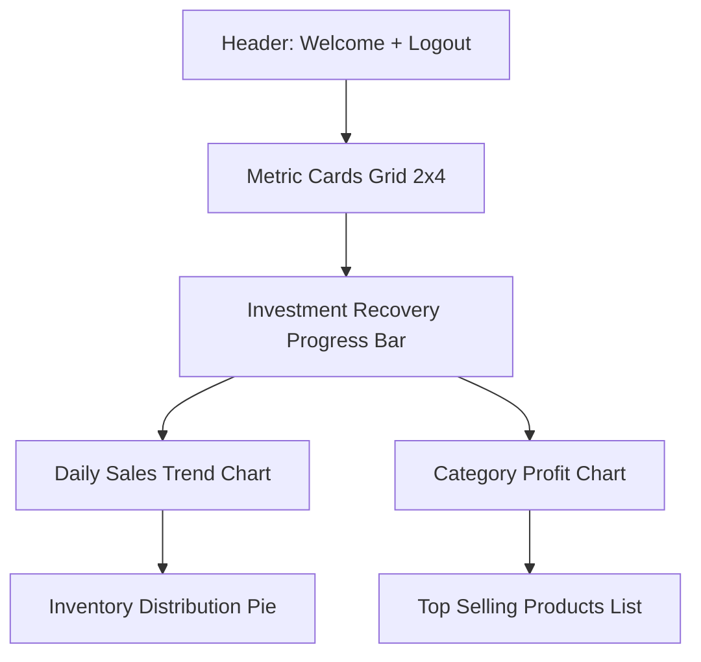
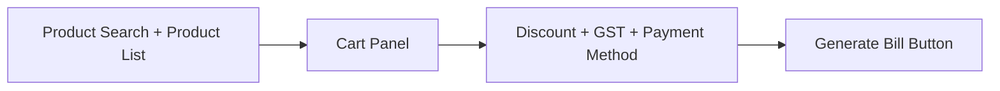
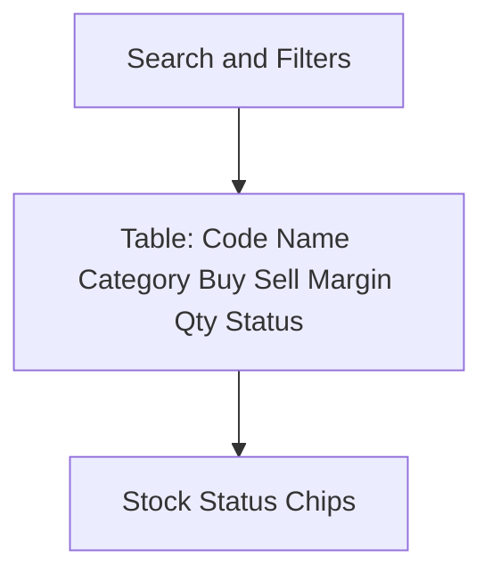

# UI Wireframes (Mobile First)

## App Navigation

```mermaid
flowchart TB
  L[Login] --> D[Dashboard]
  D --> P[Products]
  D --> S[Sales POS]
  D --> PU[Purchases]
  D --> E[Expenses]
  D --> C[Customers]
  D --> SU[Suppliers]
  D --> R[Reports]
```

## Dashboard Layout

```mermaid
flowchart TB
  A[Header: Welcome + Logout] --> B[Metric Cards Grid 2x4]
  B --> C[Investment Recovery Progress Bar]
  C --> D[Daily Sales Trend Chart]
  C --> E[Category Profit Chart]
  D --> F[Inventory Distribution Pie]
  E --> G[Top Selling Products List]
```

## POS Screen Layout

```mermaid
flowchart LR
  A[Product Search + Product List] --> B[Cart Panel]
  B --> C[Discount + GST + Payment Method]
  C --> D[Generate Bill Button]
```

## Product Table Layout

```mermaid
flowchart TB
  A[Search and Filters] --> B[Table: Code Name Category Buy Sell Margin Qty Status]
  B --> C[Stock Status Chips]
```
